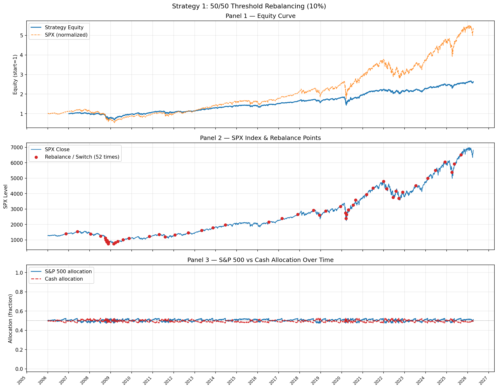

# Strategy Backtesting Guide

## How to Read the Charts

Each strategy produces a **3-panel chart**. Here is what each panel means.

---

### Panel 1 — Equity Curve

- **Blue line (Strategy Equity)**: the value of $1 invested at the start of the backtest, growing over time.  
  A value of 2.0 means the portfolio doubled; 0.5 means it halved.
- **Gray dashed line (SPX normalized)**: the S&P 500 index rescaled to start at 1.0, shown as a reference.  
  This lets you visually compare whether the strategy outperformed or underperformed a passive index investment.

**What to look for**: Does the strategy grow steadily? Does it crash less severely in bear markets (e.g., 2008–2009, 2020)? Does it recover quickly?

---

### Panel 2 — SPX Index & Rebalance Points

- **Orange line**: the raw S&P 500 index level (daily close price).
- **Red dots**: dates when the strategy triggered a rebalancing event (or a regime switch for MA Timing).

**What to look for**: Are rebalances clustered around market crashes and rallies? A good rebalancing rule should buy more stocks when the market is cheap (after a drop) and trim when it is expensive (after a rise).

---

### Panel 3 — Allocation Over Time

- **Blue line (S&P 500)**: the proportion of the total portfolio invested in stocks at each point in time.
- **Red dashed line (Cash)**: the proportion held in cash.
- **Black dotted line**: the 50% target level (for strategies with a 50/50 target).

**What to look for**: How much does the allocation drift between rebalances? For MA Timing (Strategy 5), this line is binary — it jumps between 0% and 100%.

---

## Metric Definitions

### Sharpe Ratio *(higher is better)*

> `Sharpe = Annual Return / Annual Volatility`

The most widely used **risk-adjusted return** measure. It tells you how much return you earn per unit of risk (volatility). A Sharpe of 1.0 is considered good; above 2.0 is excellent. In this context (no risk-free rate adjustment), it directly compares return efficiency across strategies.

---

### Annual Return *(higher is better)*

> Geometric mean of annualized daily returns (CAGR — Compound Annual Growth Rate)

The constant yearly growth rate that would produce the same final portfolio value. A CAGR of 10% means the portfolio grew like clockwork at 10% per year on average, accounting for compounding.

---

### Volatility *(lower is better)*

> `Volatility = Std Dev of daily returns × √252`

Annualized standard deviation of daily returns. Measures how "bumpy" the ride is. A lower volatility means the portfolio value is smoother and more predictable day-to-day.

---

### Max Drawdown *(closer to 0 is better)*

> Maximum peak-to-trough decline in portfolio value

If the portfolio grew to $1.60 then dropped to $0.80 before recovering, the max drawdown is −50%. This is the **worst-case loss** an investor would have suffered if they bought at the worst time and sold at the worst time. It is arguably the most emotionally important metric — a strategy with a −60% drawdown is very hard to hold through psychologically.

---

### Calmar Ratio *(higher is better)*

> `Calmar = Annual Return / |Max Drawdown|`

Answers: *"How much annual return do I get per unit of worst-case loss?"*  
Unlike the Sharpe Ratio which uses daily volatility, Calmar focuses on **tail risk** — the single worst episode. A strategy with 10% annual return and 20% max drawdown has Calmar = 0.5. Higher Calmar means you are compensated more generously for the pain of the worst drawdown.

---

### Sortino Ratio *(higher is better)*

> `Sortino = Annual Return / Downside Volatility`

Like the Sharpe Ratio but **only penalizes downside (negative) volatility**. The logic: investors don't mind when the portfolio moves up unexpectedly — they only care about losses. A strategy that goes up smoothly but has occasional sharp drops will have a lower Sortino than Sharpe.

---

### Avg Turnover *(lower is better, all else equal)*

> Average fraction of the portfolio bought or sold per trading day

Reflects how actively the strategy trades. In practice, higher turnover implies higher transaction costs (commissions, bid-ask spread, market impact). The Quantiacs backtester already applies a slippage model, so turnover affects the net returns.

---

### Total Return *(higher is better)*

> `Total Return = (Final Portfolio Value / Initial Value) − 1`

The simple cumulative return over the full backtest period. $1 grows to $(1 + Total Return). This is useful for understanding absolute wealth creation over the period, but must be interpreted alongside the backtest length — a 200% return over 20 years is less impressive than 200% over 5 years.

---

### # Rebalances / Switches *(context-dependent)*

- For **threshold and calendar strategies** (S1, S3, S4, S6, S7): the number of times the portfolio was rebalanced back to the target 50/50 allocation. Fewer rebalances mean lower trading costs but potentially larger drift from target.
- For **MA Timing** (S5): the number of **regime switches** (bull → bear or bear → bull). Each switch means moving either fully into stocks or fully into cash.

---

## Summary: Which Metric Matters Most?

| Goal | Focus on |
|------|----------|
| Best risk-adjusted return | Sharpe Ratio |
| Minimize worst-case loss | Max Drawdown + Calmar Ratio |
| Protect against bad streaks | Sortino Ratio |
| Minimize trading costs | Avg Turnover + # Rebalances |
| Pure wealth creation | Total Return + Annual Return |

For most long-term investors, **Sharpe Ratio** and **Max Drawdown** are the two most important. A strategy with slightly lower returns but dramatically smaller drawdowns is often preferable in practice because it is easier to hold through market crises without panic-selling.
